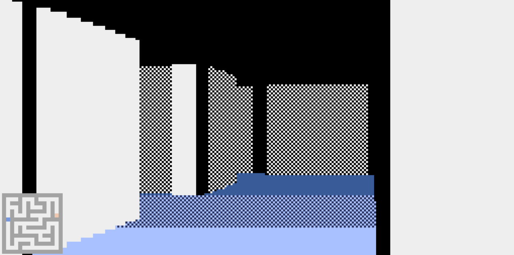

<p align="center">
    
    <p align="center">Maze solving game with randomly generated mazes and raycasting.</p>
</p>

<p align="center">
    <a href="#requirements">Requirements</a> •
  	<a href="#installation">Usage</a> •
	<a href="#controls">Controls</a> •
  	<a href="#license">License</a>
</p>

## Requirements

* Python 3.7
* [Pyxel 1.2.10](https://github.com/kitao/pyxel)

## Usage
```bash
# Install dependencies
$ pip install -r requirements.txt

# Run the game
$ python3 mazoku.py
```

## Controls

<p align="center">
    
</p>

* `W/S` - Move forward/backward
* `A/D` - Turn left/right
* `M` - Turn minimap off/on
* `R` - Generate new maze 

## License

Copyright (c) 2020 by ***Kamil Marut***

`mazoku` is under the terms of the [MIT License](https://www.tldrlegal.com/l/mit), following all clarifications stated in the [license file](LICENSE).